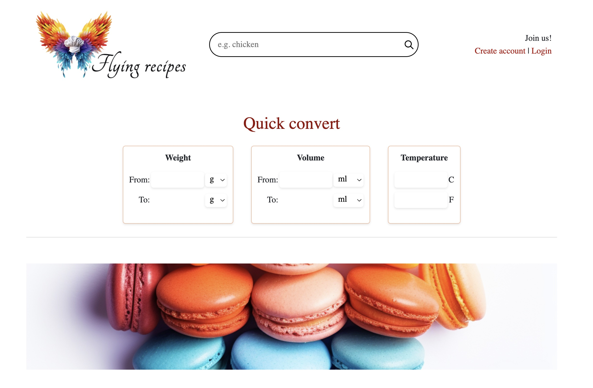
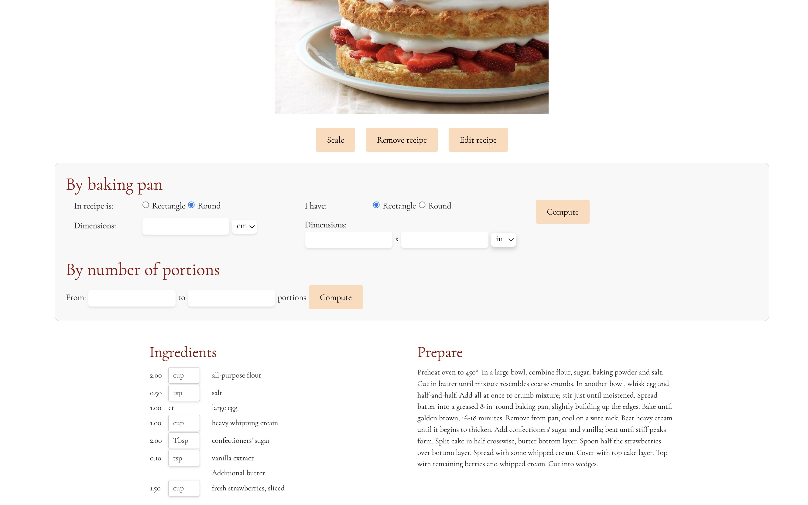
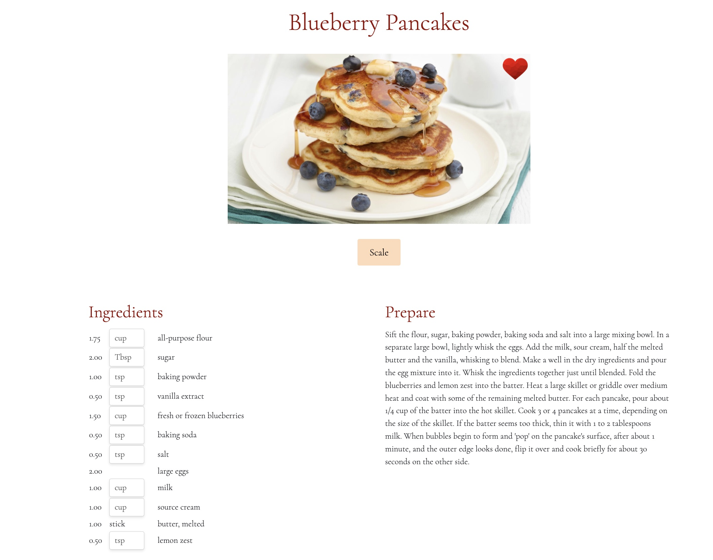
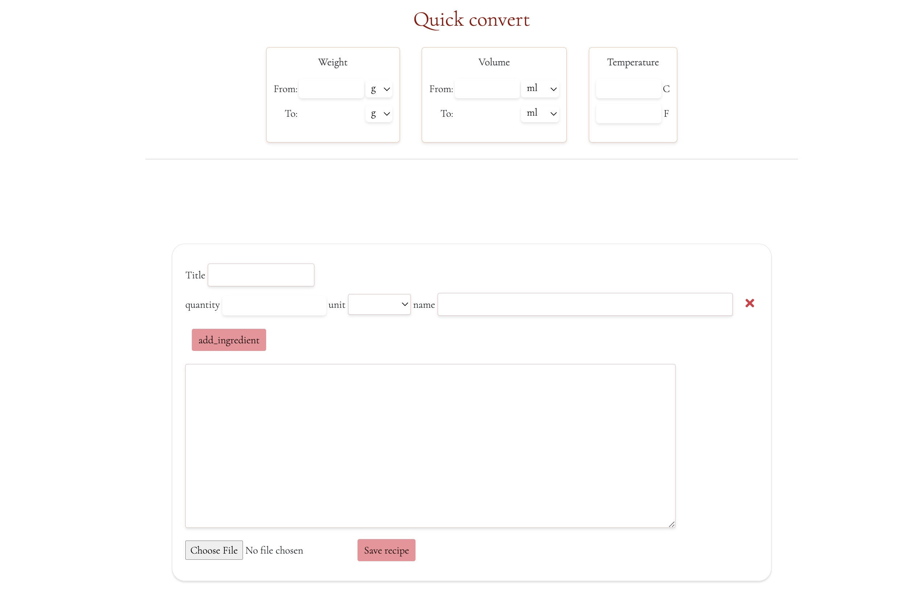
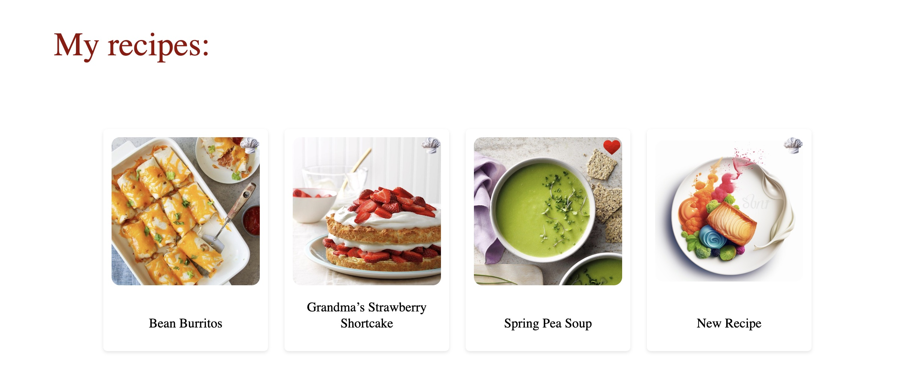
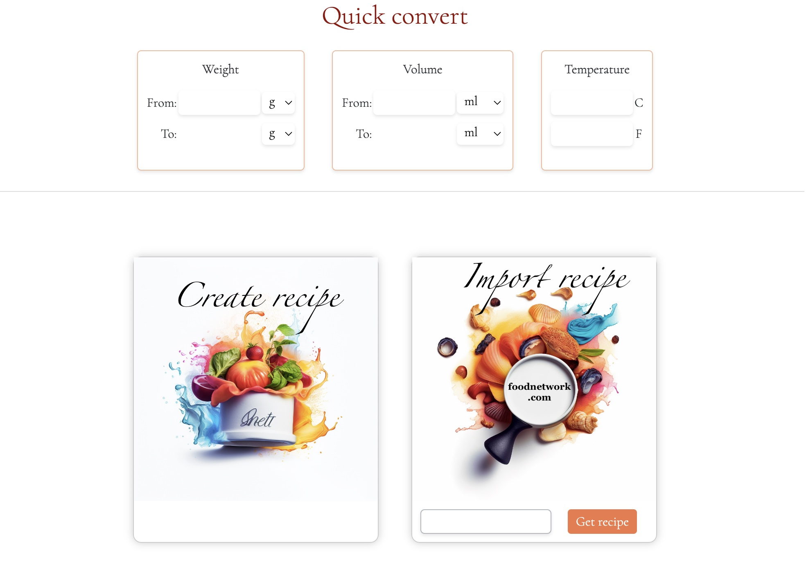

# Kitchen helper
Kitchen helper was created for people traveling around the world and dealing with different unit systems. 
The application provides the functionality of converting weight, volume and temperature units between imperial and metric systems and scaling recipes. 
It allows the user to convert one ingredient or the whole recipe. The user has access to recipes stored in the database or can create their own recipes. 
Morover the user can create a list of favorite recipes.

## Run the Kitchen helper Flask App
Set up and activate a python virtualenv, and install all dependencies:
```sh
virtualenv env
source env/bin/activate
pip3 install -r requirements.txt
```
To create database and fill it with sample data run:
```sh
python3 seed_database.py
 ```
Start up the flask server:
```sh
python3 server.py
```
Go to `localhost:5000` in your browser to see the web app

## Features
- quickly convert a single unit (weight, volume and temperature)
- create, edit, remove and save recipes
- convert units of ingredients in recipes
- scale recipes (by baking pan size or by number of portions)
- create a list of favorite recipes
- filter recipes by ingredient
- import a recipe from external website with recipes

## Technologies used
- HTML
- CSS
- Python
- JavaScript
- PostgreSQL
- Flask
- React
- SQLAlchemy
- AJAX
- Bootstrap
- BeautifulSoup

## How to use Kitchen helper

The quick convert function and the search box are on each page to make easy access to them.


The recipe view provides functions to scale, edit and remove the recipe. Good to know: only the author of the recipe can edit and remove the recipe.



Otherwise, the recipe has only the scale function.



In the create function, the author can easily add and remove an ingredient. Moreover, the user can upload a recipe image. 



If the image is not uploaded, theb recipe will be saved with a default image.



To use the web scraping function, paste the link to the recipe from foodnetwork.com and press "Get recipe".




